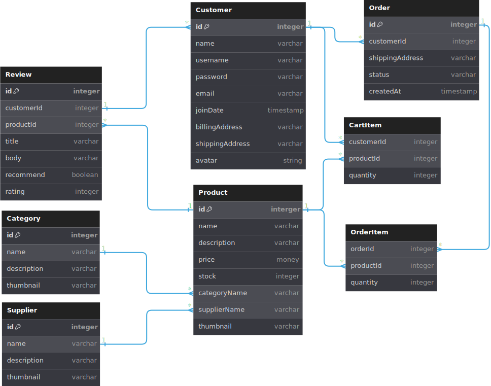

# Express, TypeScript and [Prisma ORM](https://www.prisma.io/) project

This project features a RESTful API that processes data for an ecommerce application.

## Key product features
- PSQL database server for managing customer data. Configured for [session persistence](./auth/session.ts).
- [Session and cookie-based authentication](./auth/) enabling persistent logins.
- [Middleware functions](./middleware) for data validation and user authentication
- [Data modelling](./prisma/schema.prisma) and [database migrations](./prisma/migrations/20230728105408_/migration.sql) with Prisma ORM.
- Comprehensive [integration testing](./api_tests/), achieving 90% test coverage as reported by Istanbul's *nyc* CLI.
- Programmatic [database reseeding](/prisma/seed.ts) using [dummy data](/prisma/dev_data.ts).

<p float="left">
  
  &nbsp;&nbsp;&nbsp;&nbsp;&nbsp;
  
  &nbsp;&nbsp;&nbsp;&nbsp;&nbsp;
  
  &nbsp;&nbsp;&nbsp;&nbsp;&nbsp;
   
  &nbsp;&nbsp;&nbsp;&nbsp;&nbsp;
   
  &nbsp;&nbsp;&nbsp;&nbsp;&nbsp;
  
</p>

## Endpoints
| HTTP method(s) | URL
|---|---|
POST | /signup
POST | /login
POST | /logout
GET | /products
GET | /products/:id
GET | /products/:id/reviws
GET, PUT, DELETE | /customers/:id
GET, POST, PUT | /customers/:id/cart
GET, POST | /customers/:id/orders
GET | /customers/:id/orders/:orderId
GET | /customers/:id/reviews
GET | /categories
GET | /suppliers
GET, POST | /reviews
GET, PUT, DELETE | /reviews/:id

## Data model
This is a simplified view of the entity relationships that exist within this ecommerce database. For a more complete picture, consult the **[schema configuration](/prisma/schema.prisma)** and **[migration](/prisma//migrations/20230728105408_/migration.sql)** files. 

 

## Main project dependencies
| Package | Purpose
|---|---|
Express | Web API framework
Prisma | Node.js & TypeScript ORM
SuperTest | Integration testing
Mocha | Test framework
Chai | Assertion library
Passport.js | Authentication middleware
express-session | Session middleware


## Running the project on localhost
> This project requires PSQL to be installed locally.

### Setup instructions
1) Clone and fork the repository and install all dependencies.
2) Create a local empty PSQL database called **ecommerce_db**.
3) Create a **.env** file in the root of the repository with two environment variables, ```DATABASE_URL``` and ```PORT```.
```
DATABASE_URL="postgresql://<USER>:<password>@localhost:5432/ecommerce_db"
PORT=3000
```
4) Replace ```<USER>``` with the name of your local database user (e.g. *postgres*) and replace ```<PASSWORD>``` with whatever password you used to set up the local user.

You can now run the scripts below to run the project.

### Run the Express server in development mode.
```sh
npm run dev

# or

npm run start
```

### Compile and run Mocha test suite
```sh
npm run test
```

### Test coverage report 
```sh
npm run testcov
```

### Update database schema 
This command performs 2 actions: syncs the database schema with Prisma schema and regenerates Prisma Client.
```sh
npx prisma migrate dev

# or

prisma db push
```

### Seed database
```sh
npx prisma db seed
```

### [Prisma Studio](https://www.prisma.io/studio) (browser-based GUI and database visualiser)
```sh
npx prisma studio
```